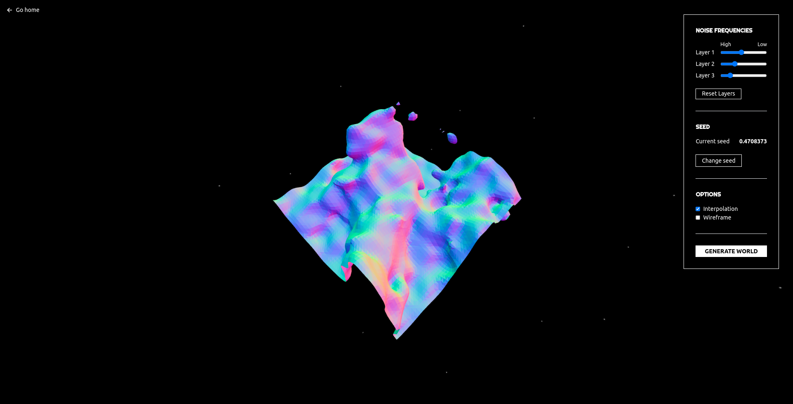
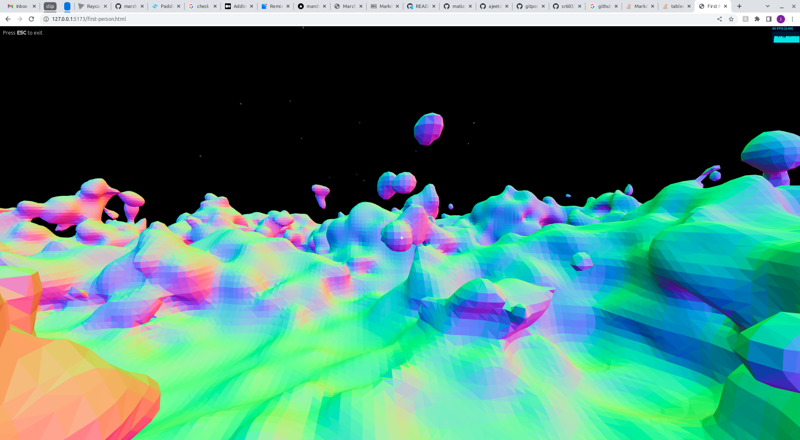

<center style="font-weight: bold; font-size: 32px">
Marching Cubes
</center>

<center style="font-style: italic">
   A 3D terrain generator
</center>


## Table of Contents
- [Demo](#demo)
- [Features](#features)
- [Installation](#installation)
- [Technology](#technology)
- [Algorithm](#algorithm)
- [Optimizations](#optimizations)
- [Acknowledgements](#acknowledgements)

## Demo

## Features

### Noise editor

- Sliders to adjust noise level of the terrain
- Button to generate random seeds
- Toggle interpolation and wireframe view

### First person mode

- View the terrain in first person
- `W`,`A`,`S`,`D` or `Arrow Keys` to move
- `Space` to jump
- `Mouse` to look around

### Terrain editor

- Deform the terrain in real time
- `Left Click` to add terrain
- `Right Click` to remove terrain

## Installation

Install the dependencies and run the app
```sh
cd marching-cubes-v2
npm install
npm run dev
```

Run tailwind to edit the CSS

```sh
npm run tailwind
```

## Technology

- [Three.js] - Markdown parser done right. Fast and easy to extend.
- [Typescript] - awesome web-based text editor
- [TailwindCSS] - evented I/O for the backend
- [Vite] - HTML enhanced for web apps!

## Algorithm

## Optimizations

| Optimization | |
| ------ | ------ |
| BufferGeometry |  |
| Layer Caching | |
| Simplex Noise | |
| Web Workers | |

## Acknowledgements

Inspired by Sebastian Lague's Youtube video


[//]: #
   [dill]: <https://github.com/joemccann/dillinger>
   [git-repo-url]: <https://github.com/joemccann/dillinger.git>
   [john gruber]: <http://daringfireball.net>
   [df1]: <http://daringfireball.net/projects/markdown/>
   [markdown-it]: <https://github.com/markdown-it/markdown-it>
   [Ace Editor]: <http://ace.ajax.org>
   [node.js]: <http://nodejs.org>
   [Twitter Bootstrap]: <http://twitter.github.com/bootstrap/>
   [jQuery]: <http://jquery.com>
   [@tjholowaychuk]: <http://twitter.com/tjholowaychuk>
   [express]: <http://expressjs.com>
   [AngularJS]: <http://angularjs.org>
   [Gulp]: <http://gulpjs.com>

   [PlDb]: <https://github.com/joemccann/dillinger/tree/master/plugins/dropbox/README.md>
   [PlGh]: <https://github.com/joemccann/dillinger/tree/master/plugins/github/README.md>
   [PlGd]: <https://github.com/joemccann/dillinger/tree/master/plugins/googledrive/README.md>
   [PlOd]: <https://github.com/joemccann/dillinger/tree/master/plugins/onedrive/README.md>
   [PlMe]: <https://github.com/joemccann/dillinger/tree/master/plugins/medium/README.md>
   [PlGa]: <https://github.com/RahulHP/dillinger/blob/master/plugins/googleanalytics/README.md>
